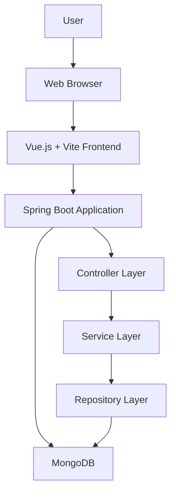

# Web shop application with a Vue.js frontend and a Spring based backend

## Overview

This project showcases a basic web shop application. The backend is built with Spring Boot and Java, using MongoDB as a database. The frontend is built with VueJs + Vite. The application can be run with or without using Docker.
Cypress is used for component and end-to-end testing.

## Prerequisites

This application can be run with or without Docker.

### To run with Docker

- Docker Desktop installed or Docker in a Linux environment (not tested yet)

### To run without Docker

- Java Development Kit (JDK) 17 or later
- Apache Maven 3.6.3 or later
- MongoDB Community Server
- Git (optional, for cloning the repository)
- Node v18+
- Npm v10.7.0+

## Run the application

For details on how to get the backend and frontend up and running locally, please refer to the ```.README``` files in the respective directories. 
To run the whole project using docker, run the following command at project root:

```sh
docker-compose up
```

## Access the application

Once the application is running, you can access it using a web browser at:

```sh
http://localhost:5173
```

## Architecture



## Troubleshooting

If you encounter any issues, ensure that:

- All prerequisites are installed and configured correctly.

Feel free to create an issue or contact the project maintainers for further assistance.
